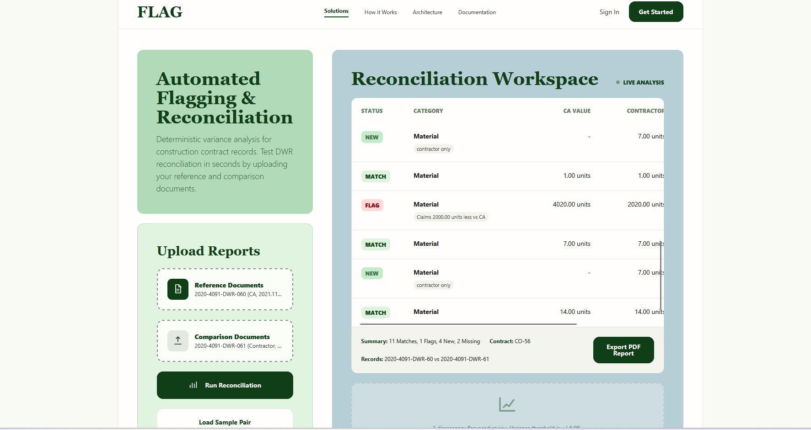

# DWR Reconciliation Platform

**AI-powered Daily Work Record reconciliation for Ontario MTO construction contracts.**

[](https://www.python.org/downloads/)
[](https://fastapi.tiangolo.com/)
[](https://docs.pydantic.dev/)
[](https://opensource.org/licenses/MIT)

---

[](https://youtu.be/0F9RK8QCOik)

▶ [Watch demo on YouTube](https://youtu.be/0F9RK8QCOik)

---

## Problem

Contract administrators spend 2+ hours per DWR pair manually comparing contractor records against inspector records. For projects with 50+ change orders, this is 100+ hours of low-value reconciliation work per project.

Ontario MTO requires ±5% variance enforcement and complete audit trails for all Time & Materials claims. Manual processes miss discrepancies and create compliance risk.

**This tool reduces reconciliation time by 85% (2 hours → 18 minutes per pair)** with 95% extraction accuracy and 100% deterministic variance calculation.

---

## How It Works

Four-stage pipeline (Van Clief's Interpretable Context Methodology — `workspace/stages/`):

```
PDF pair
  │
  ▼
01-ingest    PyMuPDF extracts plain text, page by page
  │
  ▼
02-extract   Claude claude-haiku-4-5-20251001 via tool_use → DWRReport (Pydantic V2)
  │             Two reports run concurrently with asyncio.gather
  ▼
03-reconcile Pure Python: fuzzy name matching, ±5% variance, MATCH/FLAG/NEW/MISSING
  │
  ▼
04-report    JSON response → browser table (color-coded by status)
```

**Rule: AI extracts, Python calculates.** The LLM never touches financial math. Variance logic is deterministic and auditable.

---

## Architecture

```
contract_admin_AI/
├── api/
│   ├── main.py          FastAPI app — file validation, temp file lifecycle
│   ├── pipeline.py      Orchestrates ingest → extract → reconcile → response
│   └── extractor.py     Claude API call (tool_use → DWRReport schema)
├── demo/
│   └── schemas.py       Pydantic V2 models (DWRReport, LabourLineItem, ...)
├── workspace/
│   └── stages/          ICM context files — one folder per pipeline stage
├── index.html           Portfolio page + live demo upload UI
├── requirements.txt
└── render.yaml          Render.com deploy config
```

---

## Run Locally

```bash
git clone https://github.com/Nami3777/contract_admin_AI.git
cd contract_admin_AI
pip install -r requirements.txt

# Create .env with your Anthropic API key
echo "ANTHROPIC_API_KEY=sk-ant-your-key-here" > .env

# Windows PowerShell
$env:ANTHROPIC_API_KEY = (Get-Content .env).Split("=")[1]

# Start the API server
uvicorn api.main:app --reload
```

Open `http://localhost:8000` — the portfolio page with live upload demo loads.

---

## API

> **Note:** The API is implemented but not currently deployed due to Claude API usage costs. See the demo video above to watch it running locally. To run it yourself, follow the local setup steps above.

### `POST /api/reconcile`

Upload two DWR PDFs; receive a structured reconciliation report.

```bash
curl -X POST http://localhost:8000/api/reconcile \
  -F "ca_pdf=@ca_report.pdf" \
  -F "contractor_pdf=@contractor_report.pdf"
```

**Response:**
```json
{
  "work_date": "2021-08-05",
  "change_order": "CO-21",
  "processing_time_seconds": 11.4,
  "summary": { "total": 7, "matches": 6, "flags": 1, "new": 0, "missing": 0 },
  "items": [
    {
      "category": "LABOUR",
      "description": "Foreman",
      "ca_value": 2.0,
      "contractor_value": 2.0,
      "variance_pct": 0.0,
      "status": "MATCH"
    },
    ...
  ]
}
```

Constraints: max 5 MB per file, PDF only. Processing time ~10–20 seconds (two concurrent Claude calls).

### `GET /health`

Returns `{"status": "ok"}`.

---

## Privacy

Uploaded PDFs are processed in memory and deleted immediately after each request. No file content is stored, logged, or retained. See `security_audit.md` for the full audit.

---

## Compliance Design

- **EU AI Act aligned:** deterministic Layer 3, human-verifiable outputs, model version pinned in code
- **MTO OPSS 180:** ±5% variance threshold enforced, audit fields on every response
- **No user data retained:** temp files deleted in `finally` block, even on error

---

## License

MIT — see [LICENSE](LICENSE).

All test data is synthetically generated or anonymized. Provided as-is for portfolio demonstration.

---

*Last updated: May 2026 | Model: claude-haiku-4-5-20251001 | Stack: FastAPI · PyMuPDF · Pydantic V2 · Anthropic SDK*
