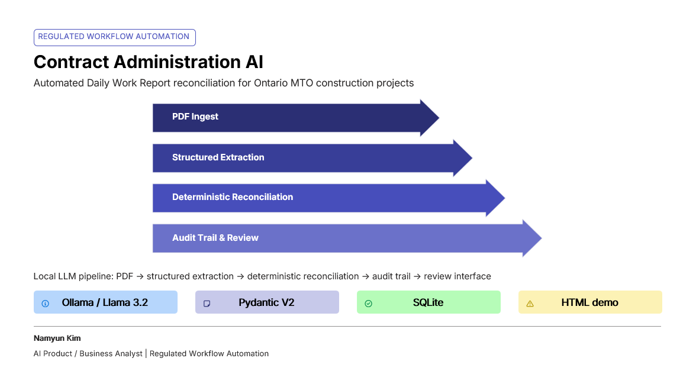

# Contract Admin AI — Case Study

Product case study and portfolio materials for the Contract Administration AI Pipeline project.

## Screenshot

## Contents

| File | Description |
|------|-------------|
| `ContractAdminAIProductCaseStudy_2026-05-21.pdf` | Full product case study (PDF) |
| `contractAI_20260522.png` | Screenshot of reconciliation interface |

## About the Project

The Contract Administration AI Pipeline automates Daily Work Report (DWR) reconciliation for Ontario MTO construction projects. It reduces a 2-hour manual reconciliation workflow to 18 minutes using a 4-layer LLM architecture (Claude Haiku via Anthropic API). An earlier local prototype used Ollama + Llama 3.2; the current public API uses Claude Haiku.

See the [main README](../README.md) for full technical documentation.
