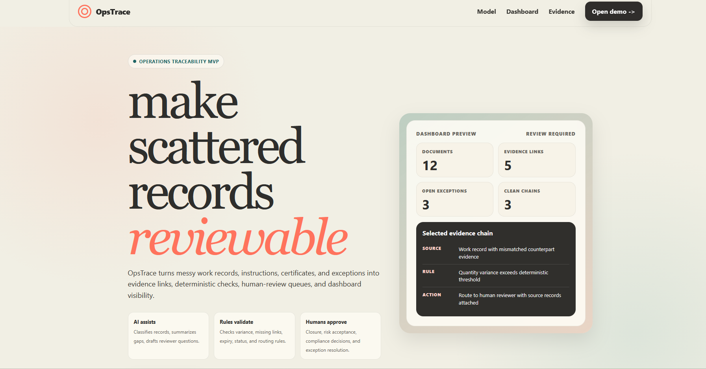
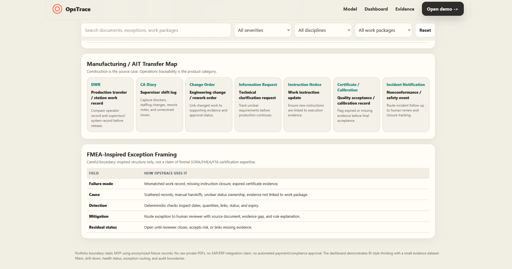

## OpsTrace Proof Bundle

**Operations traceability for anonymized operational records.**

Core principle:

> AI assists. Deterministic logic validates. Humans approve risky exceptions.

[](ops_trace_dashboard.html)

*Hero: messy records -> evidence links -> deterministic checks -> human-review queues -> dashboard visibility.*

---

### OpsTrace MVP

An **operations traceability layer for compliance-heavy workflows** that turns anonymized field-document patterns into ERP/MES-style document registers, evidence links, exception checks, human-review routing, and a manufacturing/AIT transfer map.

**What the dashboard demonstrates:**
- Document register with status tracking and work-package grouping
- Evidence link map: risk appears *between* records, not only inside one document
- Deterministic exception checks - variance threshold, missing links, expiry, routing
- Human-review queue with source records attached; humans close, not the pipeline
- BI-style drill-down: filter by severity, discipline, and work package

**Run it locally:**

```bash
# macOS
open ops_trace_dashboard.html

# Windows
start ops_trace_dashboard.html
```

Fixture: `data/ops_trace_fixture.json`  
Acceptance: `python tools/validate_ops_trace.py` - expects 12 documents, 5 evidence links, 3 open exceptions, 1 clean batch, and review required.

---

### Manufacturing / AIT Transfer Map

[](ops_trace_dashboard.html#manufacturing)

*Construction is the source case. Operations traceability is the product category.*

---

### Proof Docs

- [`docs/ops_trace_risk_model.md`](docs/ops_trace_risk_model.md)

---

### Supporting Stack

Python / vanilla HTML-CSS-JS / validation script / anonymized fixture data / dashboard-ready JSON

---

**Portfolio boundary:** static MVP using anonymized fixture records. No raw private PDFs, no SAP/ERP integration claim, no automated payment/compliance approval.
